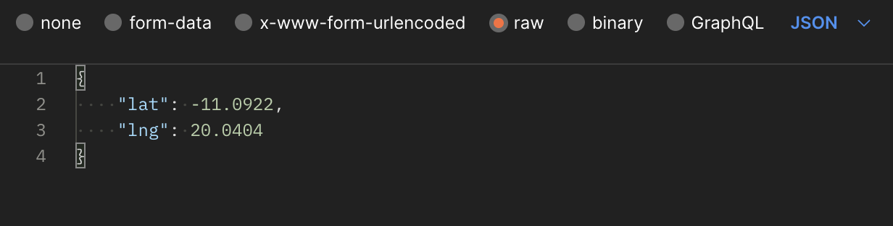
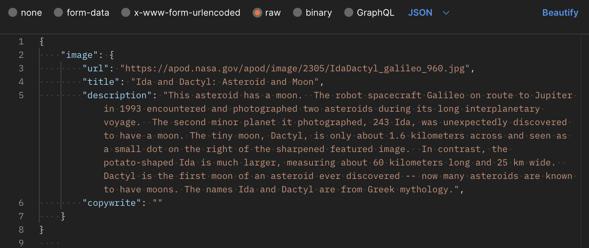
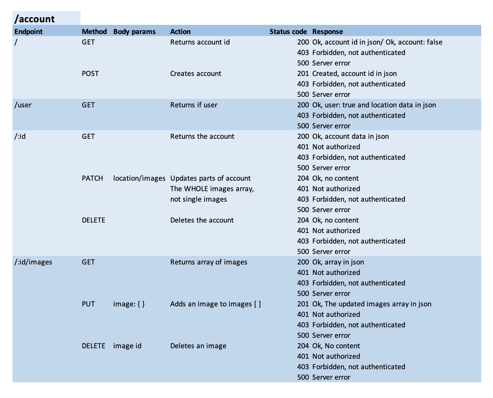
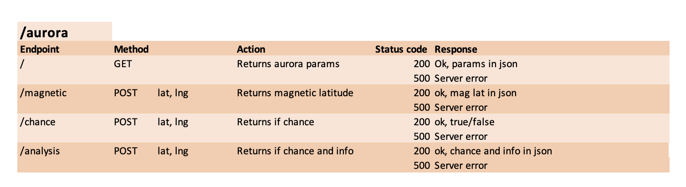
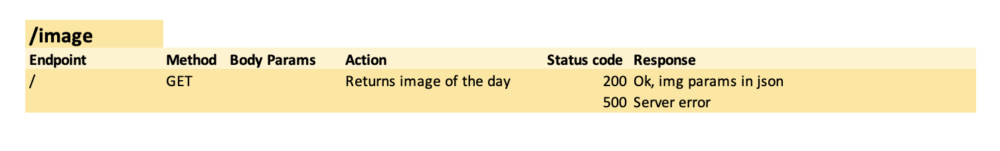
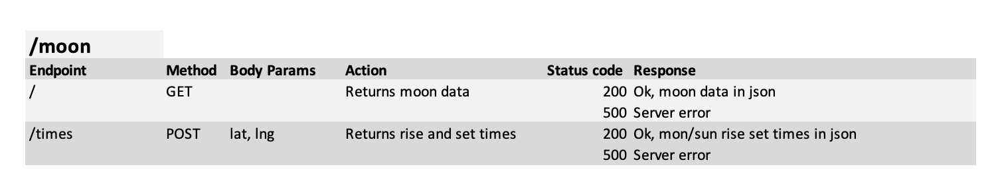
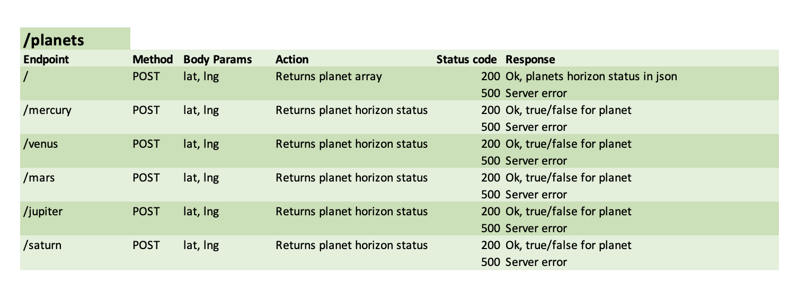

# SkySecrets API v1.0.0

This is the backend for the application SkySecrets. The application serves the user with the current state of the night sky at a chosen location. This API in turn, servers the frontend with a wide range of information regarding astonomical parameters.

## Endpoints

## Account: /account
The account endpoint registers an account, for an authenticated user, and handles all actions connected to this. The authentication is done via another api: [auth-service](https://gitlab.lnu.se/1dv613/student/ef222hr/projects/auth-service). When making calls to the accounts endpoints, make sure you have logged in via the auth-service api and that you are sending the httpOnly cookie received upon inlog with your requests. This is secured by including credentials: 'include' in the request.

## Aurora: /aurora
The aurora endpoints serve information about aurora parameters and the chances for aurora at posted location. 

## Image of the day: /image
The images endpoint acts as a safegurd between the fron end and NASAs api image of the day. It retrieves the info from NASA and forwards the neccessary data to the front. It takes no body.

## Moon: /moon
The moon endpoints serves information about the current phase and illumination of the moon. It also provides the rise and setting times for the moon, and sun, at given location

## Planets: /planets
The planets endpoint serves information about the planets position. Based on the sumbitted location it returns weather the planet/planets is/are over or under the horizon at the time when the request is made.

## API Specification

### Parameters
There are a few different parameters to have in mind when working with this api
- httpOnly cookie jwt: This is required for almost all calls to the /account endpoint

- location:

- image:

### Endpoint specification
The following tables describes all endpoints, their methods, required parameters and possible responses:

